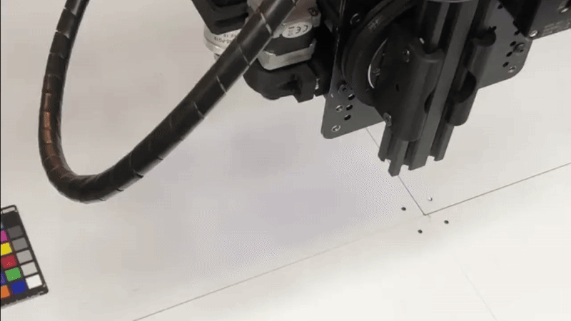
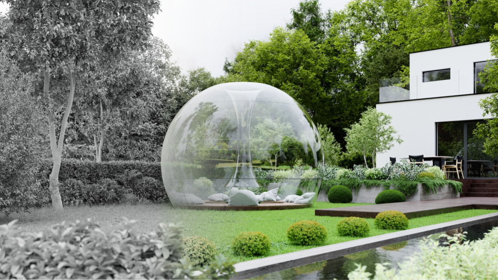
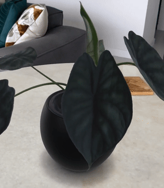

## Welcome to the 3co lab!
3co, Inc. is a [Techstars](https://techstars.com/) company that was founded by [Steven T. Jenkins](https://www.linkedin.com/in/steventjenkins/), [Robert W. Cohn](https://rwcohn.github.io/homepage/), and [Lance Legel](https://www.linkedin.com/in/legel/).

The company has been researching and developing artificial intelligence since 2018.  Our deep technical focus has always been on spatial and visual computing for designing the most beautiful and functional real world environments with plants.

Along the way, the company has also aquired mastery over 3D scanning photonics, computer vision, 3D reconstruction, graphics, and robotics.
It feels liked we've earned a few extra PhDs and a few extra grey hairs from this.

You're welcome to explore our code, get a sense of our technical capabilities, and reach out with any questions.
We especially recommend looking into our [3D reconstruction code](https://github.com/legel/3co/tree/master/reconstruction) based on iPhone Pro LiDAR data.  Its accuracy and precision can lead to photorealistic 3D models.

## Past R&D + cool demos 

### Augmented reality app for home & garden e-commerce (2018)

  - See this very elegant video about 3co made with funding from Royal FloraHolland ([_1_](https://player.vimeo.com/video/262028192?autoplay=1#t=0m59s))
  - This video shows a closer look at a simple iPhone app design for augmented reality e-commerce ([_2_](https://www.3co.ai/augmented-reality-commerce.mp4))

### Autonomous robotics for photorealistic 3D reconstruction of plants (2020)

  - Here are a few videos showing the design of our proprietary 3D vision robot called _Iris_ ([_1_](https://www.3co.ai/iris1.mp4), [_2_](https://www.3co.ai/iris_3d.mp4))
  - For a look at a real prototype, check out the duct tape on this machine, based in Amsterdam circa 2019 ([_3_](https://www.3co.ai/iris_by_3co.mp4)),
  - Eventually we filed a broad provisional patent on related hardware, vision, and AI ([_4_](https://www.3co.ai/inverse_rendering_with_3d_coordinate_measuring_machines.pdf))
  - Google Cloud Blog: _"3co reinvents the digital shopping experience with augmented reality..."_ ([_5_](https://cloud.google.com/blog/topics/startups/3co-scales-ar-commerce-with-3d-scanning))

### Photorealistic 3D model production from iPhone Pro (2022)

- Here is an extraordinarily precise 3D point cloud of an orchid, from our pipeline ([_1_](https://www.3co.ai/orchid.mp4))
- Video a plant being scanned ([_2_](https://www.3co.ai/3D_scan.mp4)), rendered ([_3_](https://www.3co.ai/3D_render.mp4)), and brought to augmented reality ([_4_](https://www.3co.ai/augmented.mp4))  

Please reach out to us (specifically, [Lance](https://www.linkedin.com/in/legel/)) if anything comes up.
