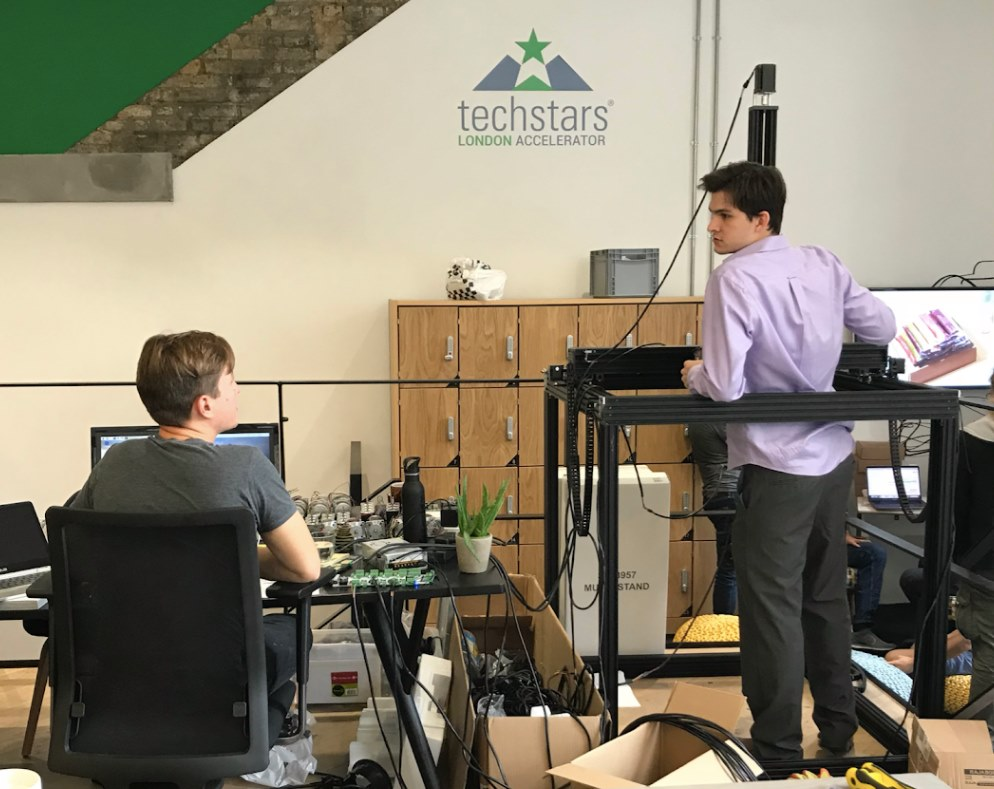
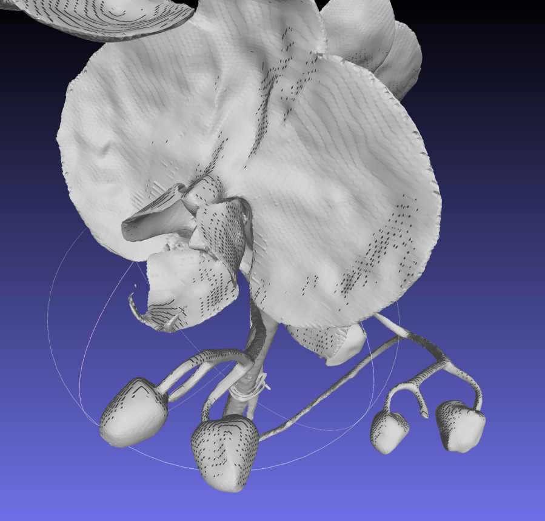

## Welcome to the 3co lab!
3co, Inc. is a [Techstars](https://techstars.com/) company that was founded by [Steven T. Jenkins](https://www.linkedin.com/in/steventjenkins/), [Robert W. Cohn](https://rwcohn.github.io/homepage/), and [Lance Legel](https://www.linkedin.com/in/legel/).

The company has been researching and developing artificial intelligence since 2018.  Our deep technical focus has always been on spatial and visual computing, especially for the analysis and design of real world environments.

Along the way, the company has also aquired mastery over 3D scanning photonics, computer vision, 3D reconstruction, and robotics.

Our [3D reconstruction AI](https://github.com/legel/3co/tree/master/reconstruction) from 2022 trained a neural radiance fields ([NeRF](https://www.matthewtancik.com/nerf)) model directly from smartphone camera and sensor data. It featured a state-of-the-art [3D surface entropy minimization loss regularization](https://github.com/legel/3co/blob/19b6c64f96b61c1f27362a796addf4d1bac34a81/reconstruction/nerf.py#L2600).

For more recent 3D reconstruction work on real world environments with Gaussian Splatting, please see this [digital twin](https://github.com/legel/digitaltwin/) repo.

## Highlighted R&D with cool demos 

#### [Augmented reality app for home & garden e-commerce](augmented_reality)

#### [Robotic 3D scanning with lasers](robotic_scanning)

#### [Autonomous LED-powered vertical tropical rainforest garden](autonomous_rain_garden)

#### [Photorealistic 3D model production from iPhone Pro](reconstruction)

#### [Plant Species Classification (2017 & 2023)](plant_classification)

## Say hello 

Please reach out to [Lance](https://www.linkedin.com/in/legel/) if anything comes up.
