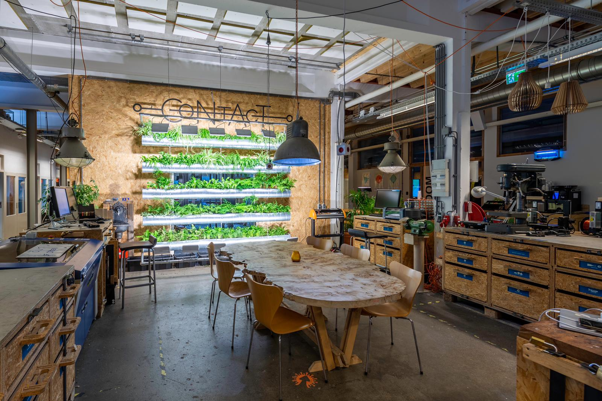
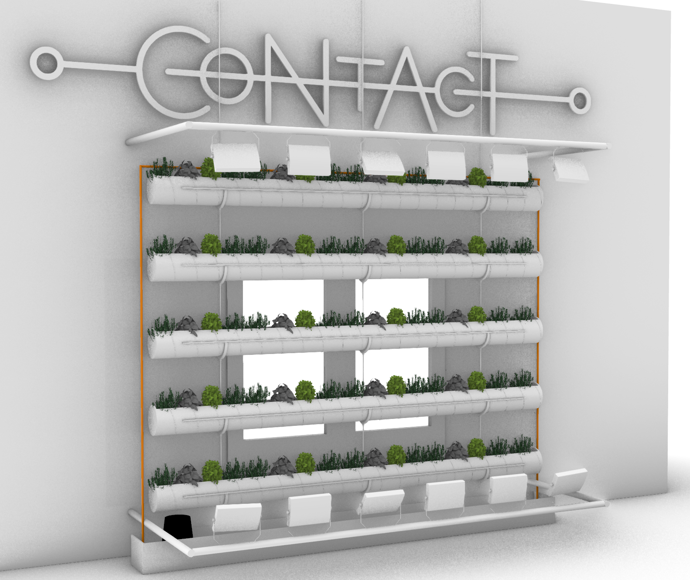
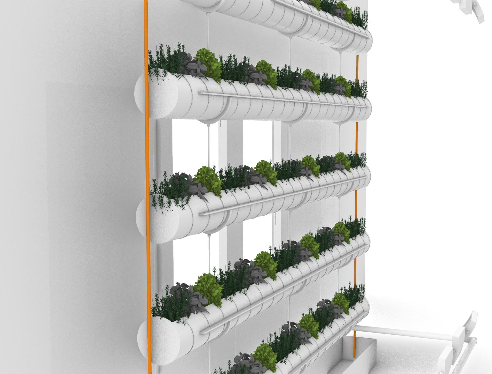
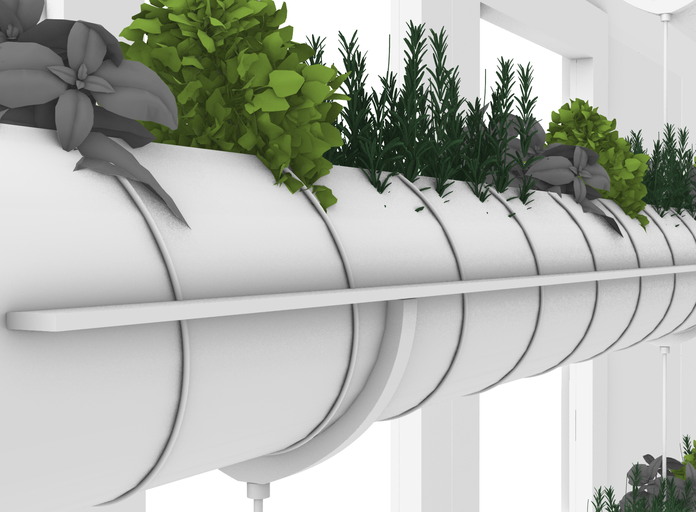
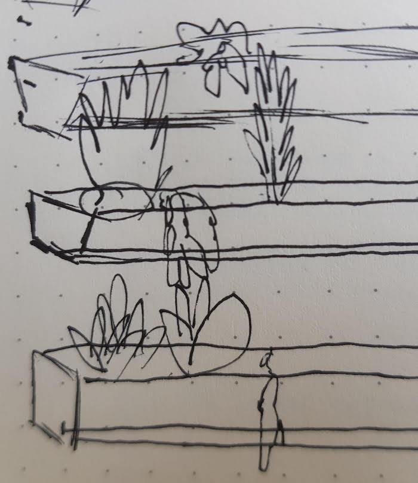
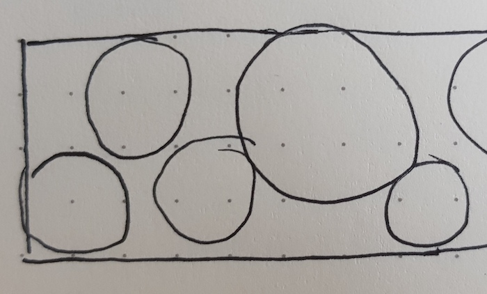
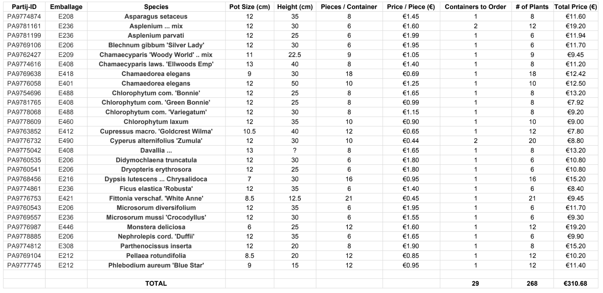
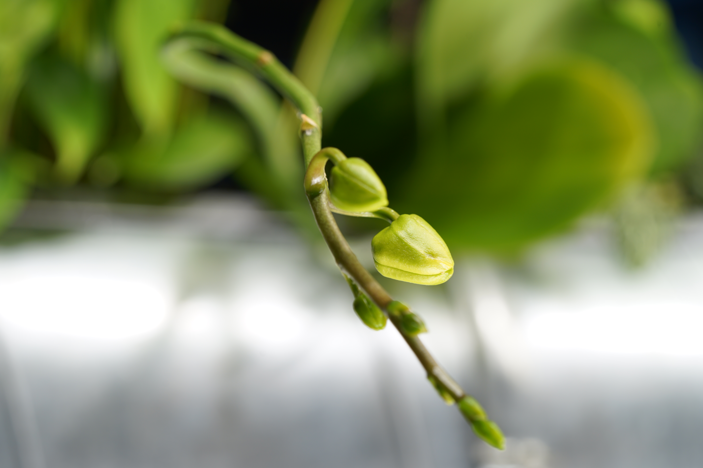
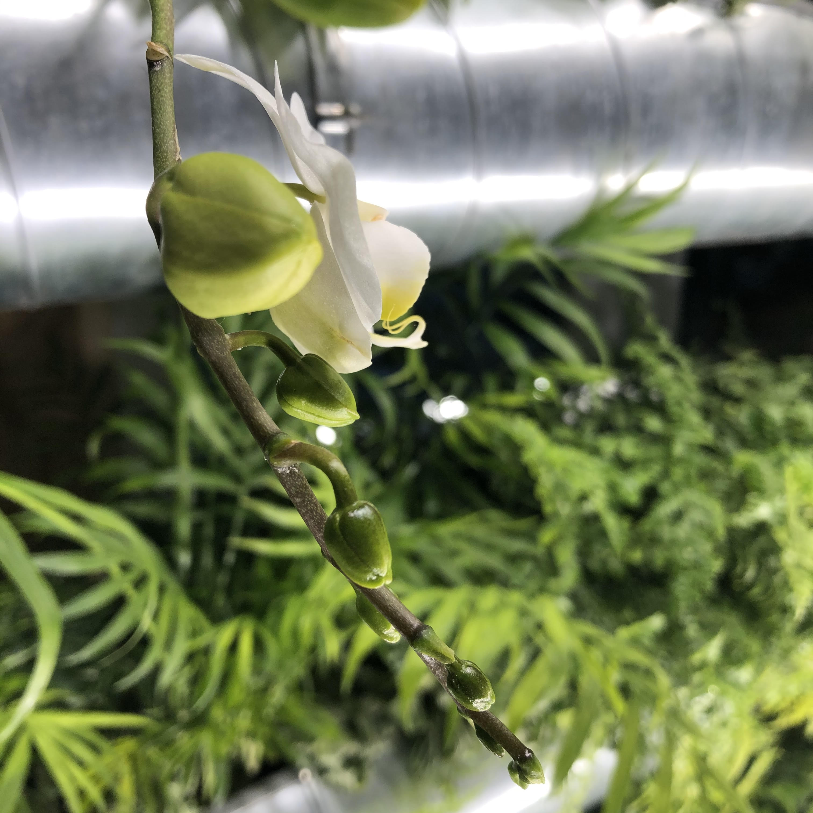

### Autonomous vertical rainforest garden

  - Video showing a vertical garden designed by 3co for an Amsterdam Makerspace ([_1_](https://ecodash.ai/images/hack.mp4))

#### 1 month of R&D in photos

