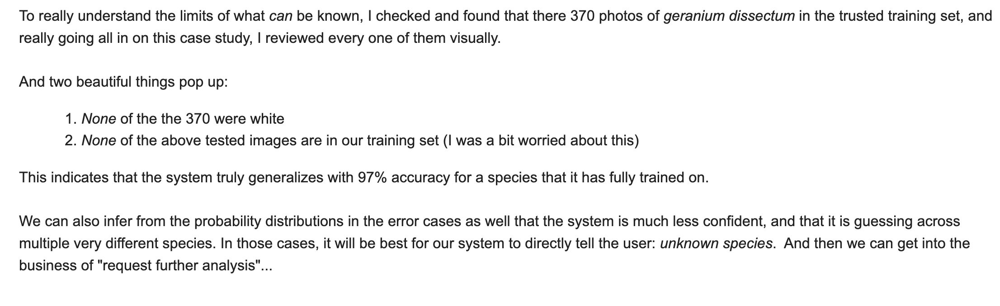

## Plant Species Classification
3co, Inc. developed two significant plant species classification systems:
- **2017:** Our first model was trained over the course of a month. It was state-of-the-art, trained via TensorFlow to classify 10,000 species based on data from [LifeClef2017](https://www.imageclef.org/lifeclef/2017/plant).  We tested a variety of model architectures, optimizers, hyperparameters, and ensembles. Eventually we developed custom data augmentations on top 1.4 million training images that allowed a [ResNet-152 v2](https://www.tensorflow.org/api_docs/python/tf/keras/applications/ResNet152V2) to achieve 97% accuracy in testing, on a test dataset that did not feature rare species.  This model was deployed online for several months and performed well enough to merit venture investment by [Royal FloraHolland](https://startupjuncture.com/2017/11/08/let-grow-class-2017-8-final-international-candidates/).
- **2023:** Prior to a workshop that we co-hosted at the University of Florida with the Environmental Horticulture department on [Intelligent Cultivation of Urban Ecosystems](https://hort.ifas.ufl.edu/intelligent-cultivation-urban-ecosystems/), we fine-tuned a [DinoV2](https://dinov2.metademolab.com/) vision transformer for species classification. This system was trained on 27 million images from [GBIF](https://gbif.org) for the classification of 33,000 plant species.  It featured similar data augmentations, as well as a deep encoding of GPS.  It achieved over 80% testing accuracy including very rare species.  This model was never fully tuned, but the direction of combining geographic knowledge and visual knowledge embedded in modern biodiversity datasets remains extremely promising.

### 2023
A pull request is outstanding [here](https://github.com/facebookresearch/dinov2/pull/305) with Meta DinoV2 for plant species classification code, that is also uploaded here as a notebook.  Below are details on this more recent model, which was also discussed in a presentation [here](https://youtu.be/jN5aHoidQZQ?si=H2In-dbeYRiwi_bm&t=1507).

### 2017

