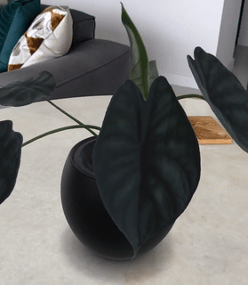

### Photorealistic 3D model production from iPhone Pro

- For reference, a video of a real _Alocasia baginda_ being scanned ([_1_](https://www.3co.ai/3D_scan.mp4))
- This neural 360 degree rendering of that plant looks really cool ([_2_](https://www.3co.ai/3D_render.mp4))
- Controling a 3D meshed model of that plant in augmented reality ([_3_](https://www.3co.ai/augmented.mp4))  
- See this amazingly precise 3D point cloud of a _Phalaenopsis_ orchid ([_4_](https://www.3co.ai/orchid.mp4))

Processing pipeline from iPhone Pro to 3D mesh generation:
1. Camera calibration and LiDAR data is collected from an iPhone Pro using custom app.
2. That is processed with code here (foundry.py) to produce a custom low-entropy neural scene representation that is very close to a surface.
3. Points are sampled in 3D from every image into discrete 3D point clouds using pointcloud_processing.py.
4. This is converted into a 3D mesh representation using mesh_extraction.py.
5. The mesh then has UV textures that are differentiably optimized through a PyTorch3D inverse rendering process in inverse_rendering.py.

#### 2 years of R&D in photos

