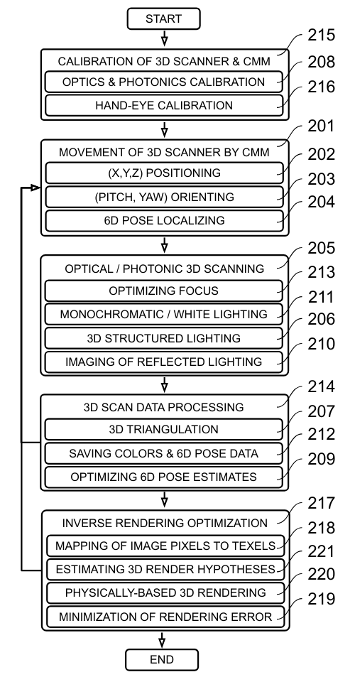

### Laser-scanning robotics for 3D scanning plants

  - Here are a few videos showing the design of our proprietary 3D vision robot called _Iris_ ([_1_](https://www.3co.ai/iris1.mp4), [_2_](https://www.3co.ai/iris_3d.mp4))
  - For a few looks at a real prototype, check out the duct tape on this machine, based in Amsterdam circa 2020 ([_3_](https://www.3co.ai/iris_by_3co.mp4), [_4_](https://www.3co.ai/iris_vision.mp4)), 
  - Eventually we filed a broad provisional patent on related hardware, vision, and AI ([_5_](https://www.3co.ai/inverse_rendering_with_3d_coordinate_measuring_machines.pdf))
  - Google Cloud Blog: _"3co reinvents the digital shopping experience with augmented reality..."_ ([_6_](https://cloud.google.com/blog/topics/startups/3co-scales-ar-commerce-with-3d-scanning))
    

#### 3 years of R&D in photos

